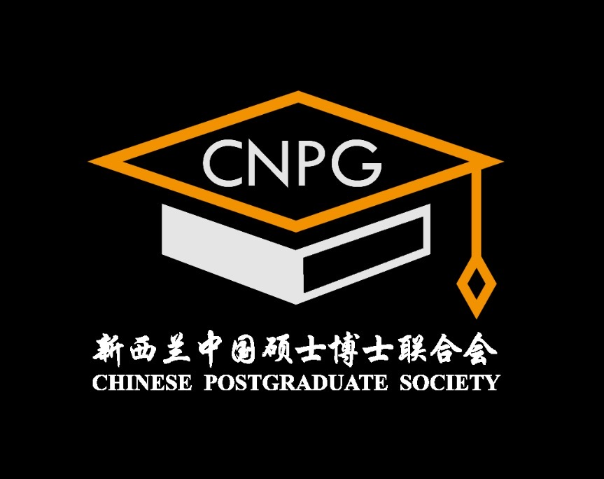

长图去掉，放到event
统一各页面的页头和页脚

加入wechat弹窗，微信小助手二维码
/小助手/公众号/小红书
首页顶部join us跳转到表格
服务器调试/DNS修改
迁移新的数据

Footer的logo换成黑色

图文资料
中英文文案
发点博文

重新加入这一段，链接到about，内容是硕博会简要介绍

硕士博士学生在新西兰的家
新西兰中国硕士博士联合会 (NZ Chinese Postgraduate Society )
硕博会是新西兰最大的硕士博士协会。目前超过2000会员。我们专注打造新西
兰优秀的 “一站式〞研究生互动平台，通过学术交流和娱乐活动丰富会员在新西兰的学习与生活，服务广大华人硕士博士，共同成长。
人会要求：新西兰硕士Master/博士PhD/荣營Honour/Postgraduate Diploma
在读或者毕业2年内（本科同学有读研意向欢迎关注我们公众号）
一 新西兰奥克兰大学UOA旗下学生社团
一2次获得奥克兰领区优秀学生学者联谊会
-新西兰工商局注册的非营利组织
一获得奥克兰大学 "New Club Award"
一中国驻奥克兰总领馆认可的学生会之一一中国博士人才网认证的全球50家高质量学生会之一
人会福利：
•免费人会
•奥克兰约60家商家优惠折扣（持续更新中）
•每月各类学术/娱乐/运动/艺术/文化等活动
也欢迎推荐同学/朋友
加人哟～
•超多惊喜福利等着你
